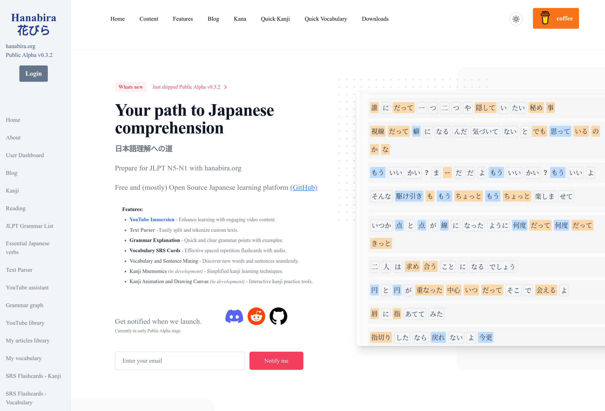
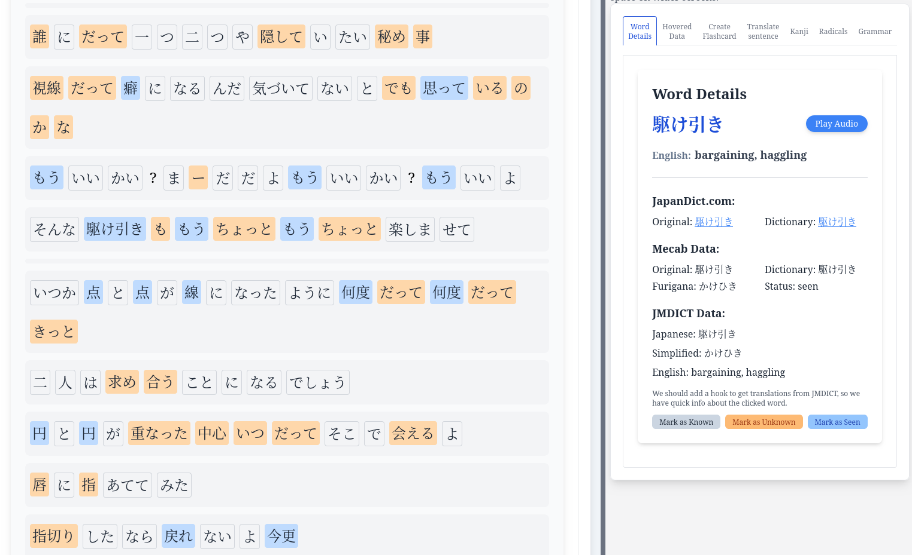
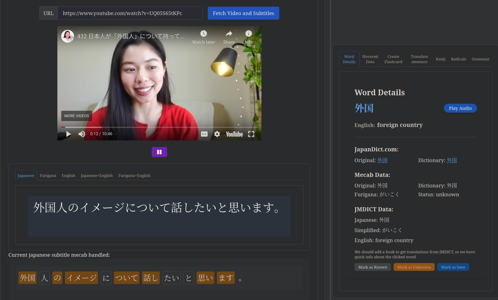
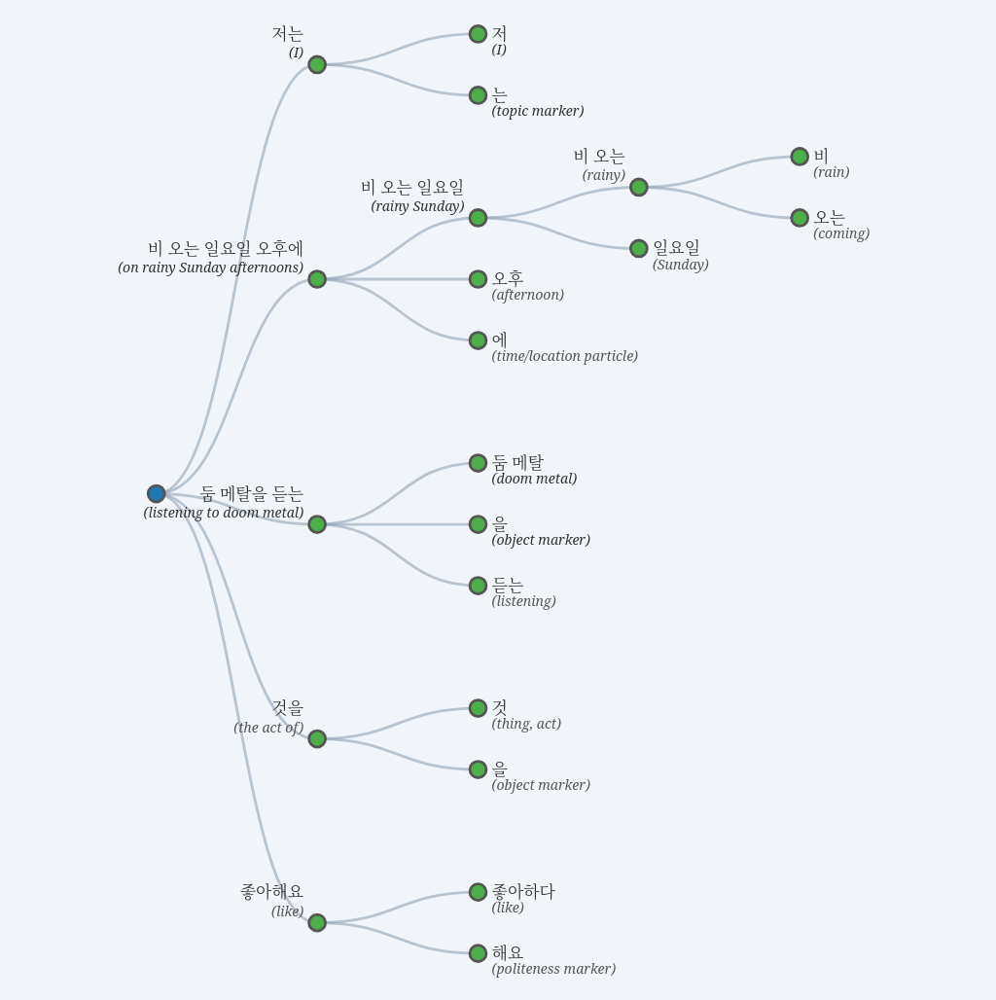
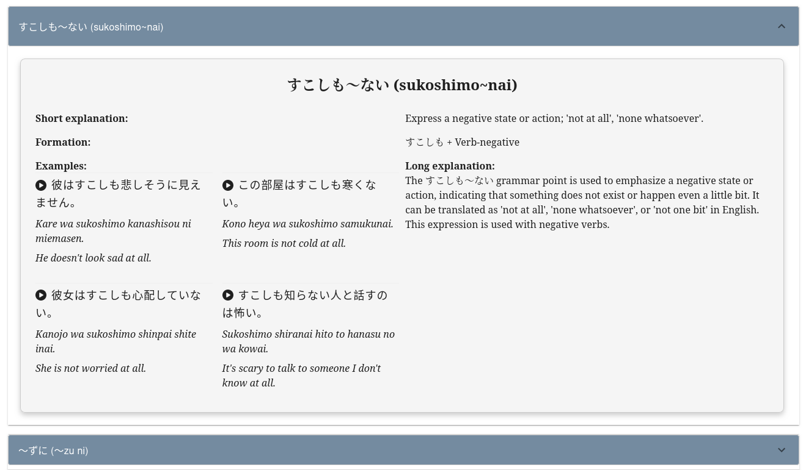
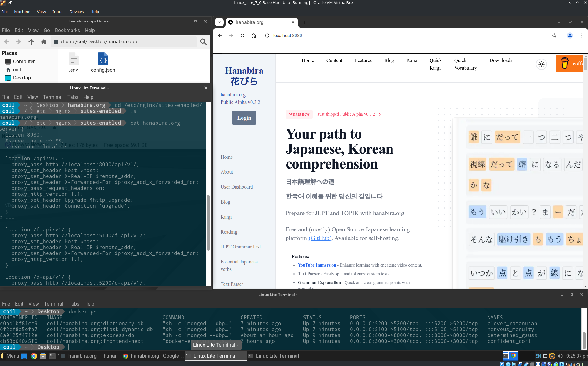

# hanabira.org

https://hanabira.org - free Japanese learning open source website portal.

Unlike other language learning portals, this project is fully open sourced, including its full content - with vocabulary, example sentences, grammar explanations, short stories and SRS flashcards.

Currently hanabira provides content mainly for Japanese language, but eventually we will be adding Korean, Vietnamese and Thai.


## Licence

Project is licenced under AGPL Licence v3.0.
It basically means, that you can use hanabira.org code and content for personal and commercial use, but any code/content built upon hanabira codebase must remain Open Sourced (even for commercial solutions).

Additionally, if you will be using our code/content, we require backlink to https://hanabira.org and this repo (https://github.com/tristcoil/hanabira.org).
If you will be running hanabira website on your servers, then we require backlink to https://hanabira.org in the footer of every page.

By using our code/content, you agree to these requirements.

# Hanabira.org - Your Path to Japanese Comprehension 
## Open-Source, Self-Hostable

[**Hanabira.org**](https://hanabira.org)
 is a free and open-source Japanese learning platform designed to help you prepare for JLPT N5-N1. Our platform offers various tools to enhance your Japanese language learning experience, from text parsing and grammar explanations to YouTube immersion and kanji mnemonics. Can be Self-Hosted.
Korean content to be added soon(ish).

## Features

- **YouTube Immersion** - Enhance learning with engaging video content.
- **Text Parser** - Easily split and tokenize custom texts.
- **Grammar Explanation** - Quick and clear grammar points with examples.
- **Vocabulary SRS Cards** - Effective spaced repetition flashcards with audio.
- **Vocabulary and Sentence Mining** - Discover new words and sentences seamlessly.
- **Kanji Mnemonics (in development)** - Simplified kanji learning techniques.
- **Kanji Animation and Drawing Canvas (in development)** - Interactive kanji practice tools.

## Screenshots

### Hanabira Project


### Text Parser


### YouTube Immersion


### Grammar Graph 


### Grammar Explanations
 


## Self-Hosting

Hanabira (https://hanabira.org/) can be run locally or on your server/laptop. To get started quickly, you can run Hanabira public Docker images.
Current setup requires also NGINX reverse proxy, so the containers find each other and so that Certbot can easily renew SSL certificates on our Hanabira.org server.
Eventually we will have fully containerized setup with docker-compose for one-click spin-up. Currently, Docker images are too big and un-optimized, this will be fixed once we get out of Alpha stage.

1. **NGINX and Docker containers**

Use clean VirtualBox Linux Ubuntu based VM machine.
Check `config` directory in the GitHub repo https://github.com/tristcoil/hanabira.org , put `.env` and `config.json` files into a directory ideally called `hanabira` from which we will mount these files into the containers. These files will contain your OpenAI and DEEPL API keys. Also put `hanabira.org` NGINX file into `/etc/nginx/sites-enabled` directory (and delete `default` config file). Restart NGINX.

Start pre-made public hanabira containers. One of the containers will need to mount the config files.
```bash
#FRONTEND-NEXT
docker run -d   -p 3000:3000   -e REACT_APP_HOST_IP=$(hostname -I | awk '{print $1}')   --restart=unless-stopped   coil/hanabira.org:frontend-next

#STATIC BACKEND EXPRESS+DB
docker run -d   -p 8000:8000   -e REACT_APP_HOST_IP=$(hostname -I | awk '{print $1}')   --restart=unless-stopped   coil/hanabira.org:express-db

#DYNAMIC BACKEND FLASK+DB
docker run -d -p 5100:5100 -v /home/coil/user_db:/data/db --add-host=host.docker.internal:host-gateway --restart=unless-stopped coil/hanabira.org:flask-dynamic-db

# DICTIONARY/TEXT PARSER/YOUTUBE backend image /d-api/v1              
docker run -d -p 5200:5200  --add-host=host.docker.internal:host-gateway -v $(pwd)/.env:/app/.env -v $(pwd)/config.json:/app/config.json --restart=unless-stopped coil/hanabira.org:dictionary-db
```

Hanabira will be then accessible locally on:
http://localhost:8080/

If you cannot reach the website locally, we recommend to check if all containers are running and to clear browser cache.


Notes on Docker and NGINX handling:
```bash
Setup reverse NGINX proxy:
sudo apt-get install nginx 
sudo systemctl enable nginx 
sudo systemctl start nginx 
# put hanabira.org file into /etc/nginx/sites-enabled directory, also delete file called "default" so it is not conflicting our new config and restart nginx
sudo systemctl restart nginx 
sudo systemctl status nginx

Install Docker:
sudo apt-get install docker-compose
sudo usermod -aG docker $USER
(then reboot VM for the changes to take effect, there are options without reboot, this one is just easy)
```

Self hosted Hanabira in Virtual Box VM:
 


# Contributing
We welcome contributions from the community! To contribute:

- Fork the project.
- Create a new branch (git checkout -b feature/YourFeature).
- Commit your changes (git commit -m 'Add new feature').
- Push to the branch (git push origin feature/YourFeature).
- Open a Pull Request.

Note: Hanabira project has main private repo, the public one contains only individual releases (not day-to-day dev progress).

## Contact
For more information, visit Hanabira.org or join our Discord community. <!-- Update with actual link -->

<!-- Replace with actual image link -->


We look forward to your feedback! Happy learning!


## Contact Us
If you have any questions or need more information, feel free to reach out to us. We welcome your feedback, bug reports and feature requests. Currently the site is in Public Alpha, so there are lots of bugs that we are already aware of. Also the source code is one big mess, we are working on reducing technical debt.

Hanabira Project Subreddit
https://www.reddit.com/r/hanabira/

Lead Developer on Reddit
https://www.reddit.com/user/tcoil_443/

Hanabira Discord server
https://discord.com/invite/afefVyfAkH


## Sources & Literature:

### Japanese
• Nihongo So Matome JLPT N2 series
• Nihongo So Matome JLPT N3 series
• Nihongo So Matome JLPT N4 series
• Nihongo So Matome JLPT N5 series
• 600 Basic Japanese Verbs, Tuttle Publishing
• New Kanzen Master JLPT N3 Tango Word Book (Shin Kanzen Master: JLPT N3 1800 Important Vocabulary Words)

### Vietnamese
• Let's speak Vietnamese (Binh Nhu Ngo)
• Vietnamese as a second language (Hue Van Nguyen)

### JLPT graded vocabulary lists 
are from
https://www.tanos.co.uk/jlpt/
licensed under Creative Commons "BY" Licence


### Pictures
https://unsplash.com/
with permissive licence
